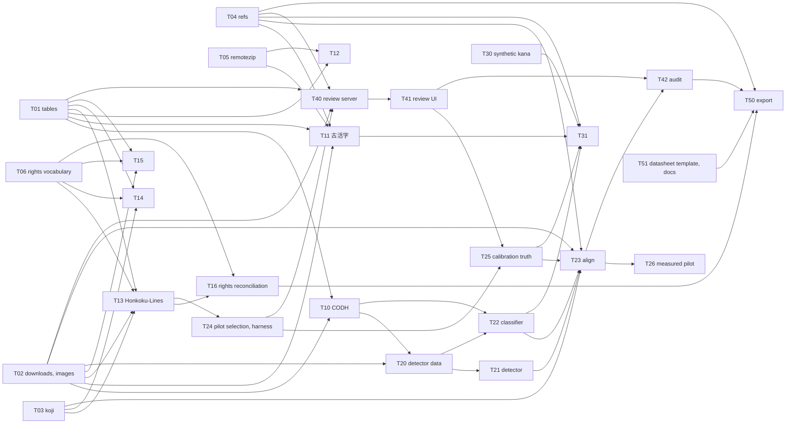

# Implementation

The work is cut into task cards under `tasks/`. Each card is self-contained: what to read first, the
inputs, the outputs with exact paths, the command-line interface, the steps, the edge cases, the
tests, and the acceptance criteria. A card can be handed to one implementer without the rest of the
repository's history. Every implementer reads this page before the card.

## Conventions

- Python 3.12, `uv`, `ruff`, `pytest`. Run `uv sync --all-extras --group dev`, then
  `uv run ruff check src tests scripts` and `uv run pytest -q` before opening a pull request.
- One card per branch and per pull request, branch `feat/<task-id>-<slug>` from `main`, title
  `feat(T13): import Honkoku-Lines`. CI runs lint and tests on every pull request.
- Every record goes through the models in `src/kuzushiji_atlas/schema.py` and every table through
  `tables.write`. Schema changes are allowed when a card says so; update `docs/schema.md` in the
  same pull request.
- Ids of imported records are deterministic from the upstream identity (see `docs/schema.md`), so a
  second import produces byte-identical tables.
- Network access happens only in commands, never in tests. Tests use small synthetic fixtures built
  in `tmp_path`; a local HTTP server fixture stands in for remote hosts.
- Downloads go under `cache/`, intermediate tables under `work/<source>/`, releases under `out/`.
  None of these directories is committed. Data files in `data/` are small tables with a header line
  naming their source and licence.
- Requests to institutional servers carry the User-Agent
  `kuzushiji-atlas (+https://github.com/mkpoli/kuzushiji-atlas)` and wait at least 3 seconds
  between requests to the same host; CODH and Hugging Face get 1 second. Retries back off
  exponentially and give up after five attempts.
- Upstream inputs are pinned: a zip by size and checksum, a Hugging Face file by revision, a git
  clone by commit; the pin is written into the source file under `data/sources/` on first import.
- Counts that the upstream publishes are acceptance criteria: an importer that returns a different
  count fails its card until the difference is explained in the pull request.
- The pull request description carries the command that was run and the counts it printed.
- Prose in docs and comments states facts about the subject. No hype adjectives, no "not A but B"
  constructions, no notes about the process that produced the text.

## Work packages and dependencies

| Package | Cards | Purpose |
| --- | --- | --- |
| Foundation | T01–T06 | tables, downloads and image cache, markup parser, reference tables, remote zip, rights vocabulary |
| Importers | T10–T16 | every upstream into the tables, rights reconciled |
| Detection and alignment | T20–T26 | character boxes inside lines, aligned to the transcription, measured on a pilot |
| 字母 | T30–T31 | kana form classification |
| Review | T40–T42 | review service and interface, audit sampling |
| Release | T50–T51 | export, attribution, datasheet, documentation |

Cards without a path between them can run at the same time. The path to the first measured
pilot is T01, T02, T03, T06 → T13 → T24 → T40 → T41 → T25 → T23 (with T10 → T20 → T21 and T22
beside it) → T26; the human annotation in T25 and T26 is the part that sets the pace. The 字母
classifier (T31) is on no path to release 0.1.

## Hardware

One workstation: 16 CPU cores, 47 GB RAM, one GPU with 16 GB VRAM (Blackwell generation, needs a
PyTorch build with CUDA 12.8 or later), 148 GB free disk. Training cards state their memory budget;
image caches are large (CODH pages about 7 GB; the Honkoku-Lines bundled line crops are 103 GB and
are never fetched whole: pilot pages come from the holders' IIIF servers as full pages), so cards
that fetch images take `--limit`, `--document` or `--pages` options and never assume the whole
corpus is local. Tiles and crops are generated on demand; checkpoints and caches stay outside git.
